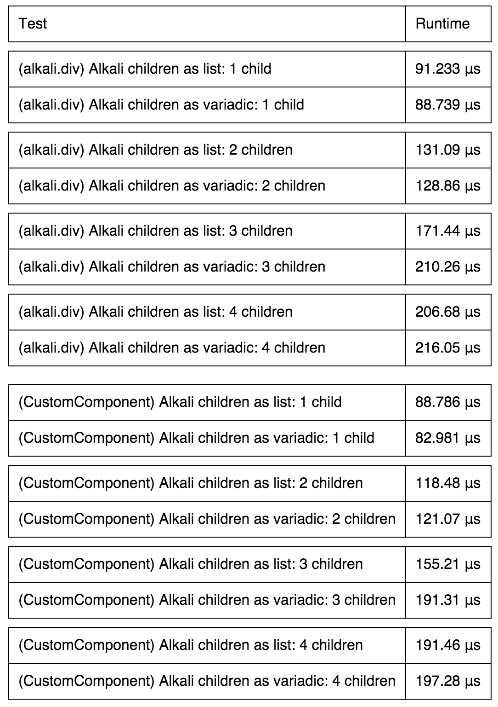
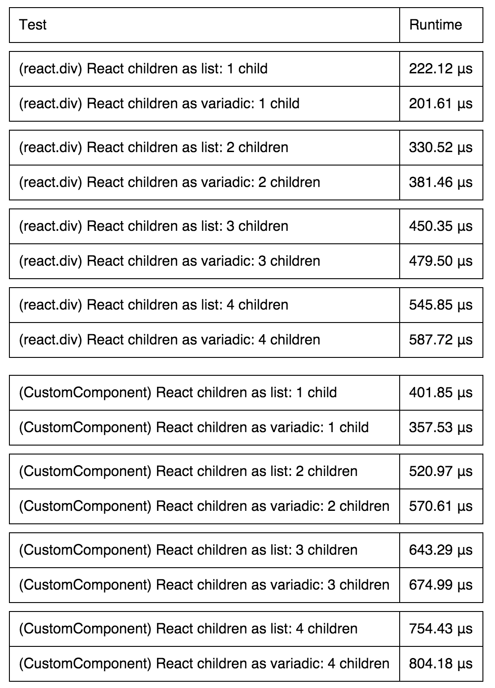

# Benchmarks

+ [Running Benchmarks](#running-benchmarks)
+ [alkali](#alkali-benchmarks)
+ [react-dart](#react-dart-benchmarks)

## Running Benchmarks
- Run `pub serve --mode=release`.
- Open browser to `localhost:8080/benchmark`.
  - Make sure to use browser other than `Dartium` to test the `dart2js` output.
- Click on either link.
  - Make sure to leave that tab/window focused otherwise benchmarks will take much longer.

## `alkali` Benchmarks
If you do not want to run benchmarks yourself these are previously run benchmarks for `alkali`. _Last updated 1/11/15._

## `react-dart` Benchmarks
If you do not want to run benchmarks yourself these are previously run benchmarks for `alkali`. _Last updated 1/11/15._

